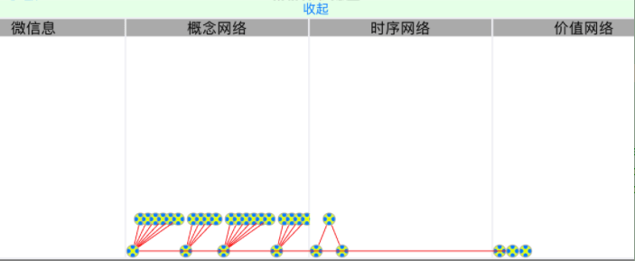
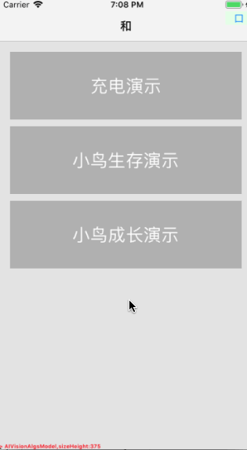

## v1.0 可视化-字符串

> 直接使用"字符串"来打印控制台显示网络内容;

***

## v2.0 可视化-图形

> 使用"view图形化"来显示整个网络的缩影;
> 1. 可操作
> 2. 动态扩展

* 说明
  - NVDelegate_He是He的可视化代理实现范例,同样你也可以写你自己的代理实现,来支持你们自己的神经网络;

* 项目结构为:
  * 网络的总可视化窗口:NVView
  * 一个网络含多个模块:NVModuleView
  * 一个NVModuleView含多个节点:NVNodeView
  * 所有节点间,可能包含多个关联NVLine

***

## v2.1 可视化优化

> **更新日志:**
> 1. UI调节与排版美化;
> 2. setDatas()和clear()功能;
> 3. 性能优化
> 4. 完善he代理;
